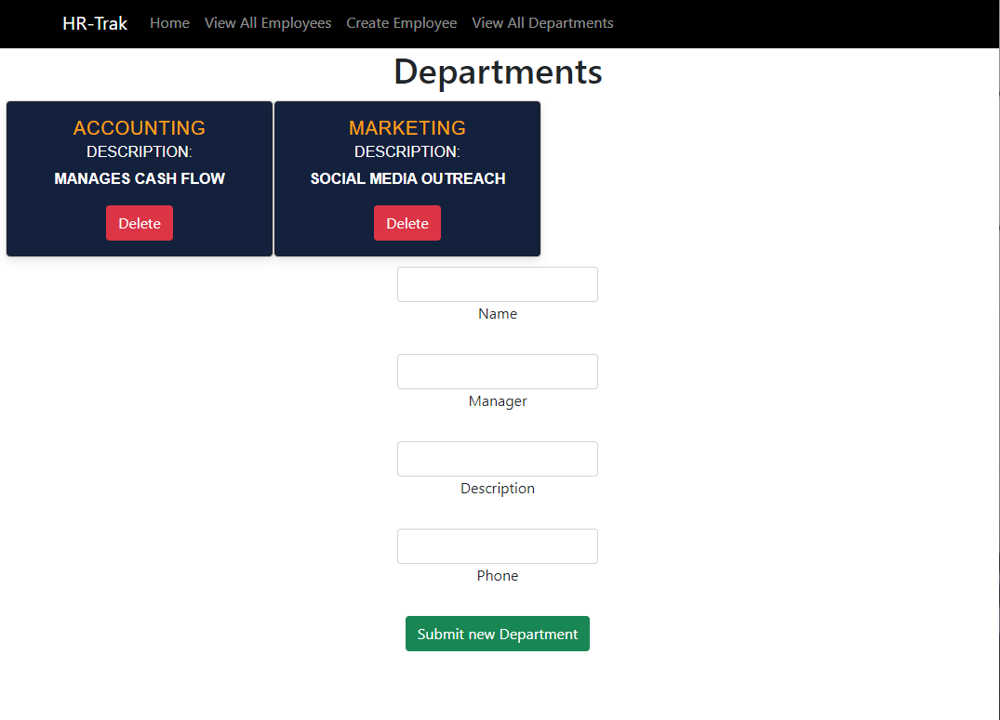

# HR-Trak

HR-Trak:

This app is meant to be used internally within any organization to keep track of employees and departments as well as updating any information within them. 
### Technologies Used

Stack: This application was created using React, MongoDB, Node JS, Express, and bootstrap.

Current Features:
- Ability to add a new employee and a new department. Each new employee requires an existing department and each department requires an existing manager(employee)
- Ability to see more details about each employee
- Ability to delete an employee

### Screenshots
Home Page:

Employee Creation:

Employee List Page:

Department List Page:

### Next Steps

Currently, the application has basic CRUD functionalities and authentication. The goal for future iterations of the application include:

- Implementing a signup/login system
- Being able to add what kind of forms an employee has filled out when they get hired
- Ability to update employees/departments 
- Implement ability to upload picture as currently it is just a placeholder picture
